# Steps

## 1
`/interface bridge port remove [find interface =ether9]`

`/interface bridge port add bridge=bridge11 interface=ether9`

`/ip address add address=172.16.1.11/24 interface=ether1`

`/ip address add address=172.16.11.254/24 interface=ether2`

## 2
tux13:
`route add -net 172.16.1.0/24 gw 172.16.10.254`

`route add -net 172.16.11.0/24 gw 172.16.10.254`

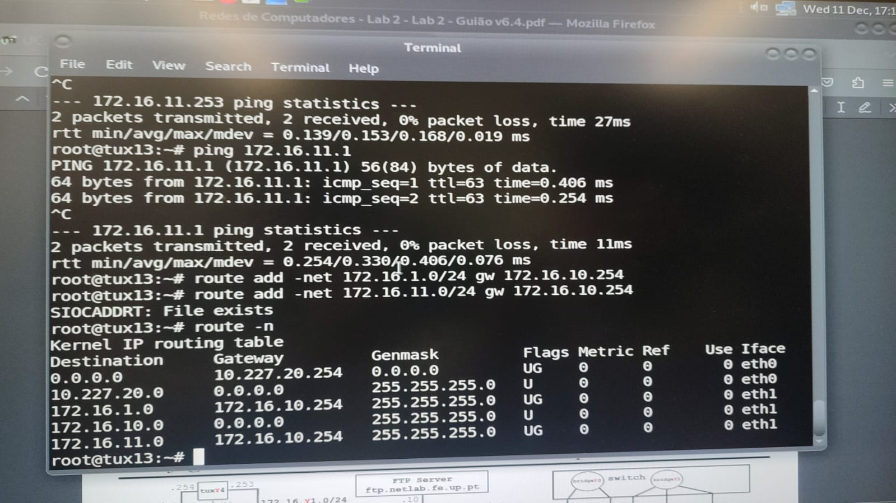

tux14:

`route add 172.16.1.0/24 gw 172.16.11.254`

- RC -> `/ip route add dst-address=172.16.10.0/24 gateway=172.16.11.253`

tux12:
`route add 172.16.1.0/24 gw 172.16.11.254`

`route add -net 172.16.10.0/24 gw 172.16.11.253`


## 3
tux13 -> tux14 (eth1)
`root@tux13: ping 172.16.10.254`

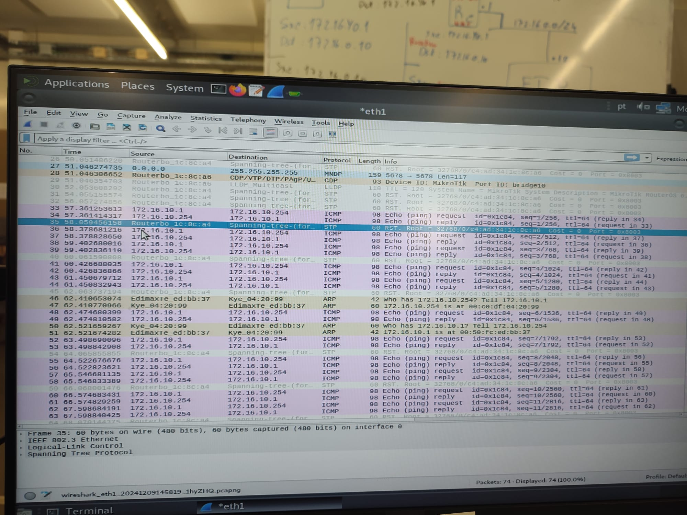

tux13 -> tux12
`root@tux13: ping 172.16.11.1`

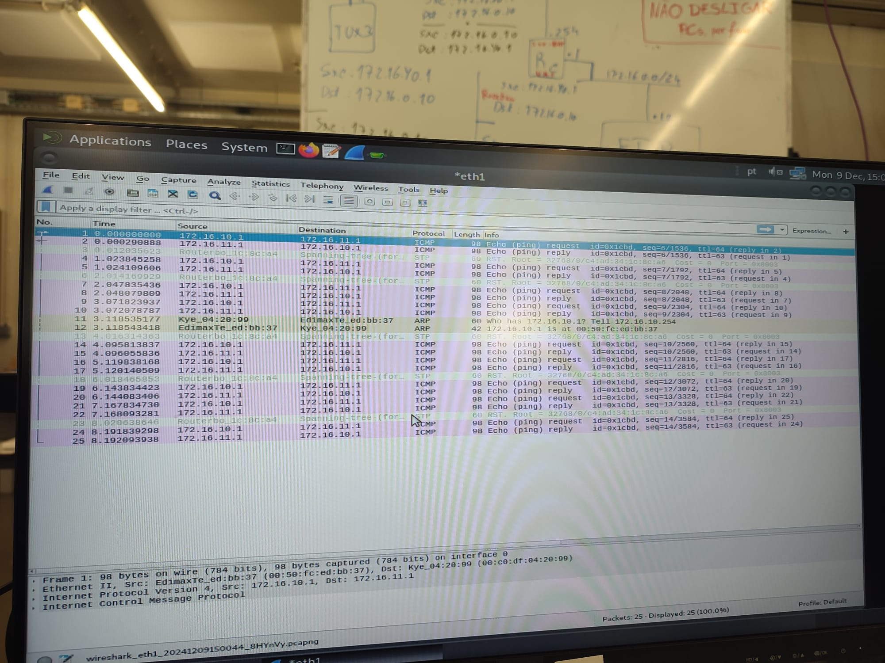


tux13 -> tux14 (eth2)
`root@tux13: ping 172.16.11.253`

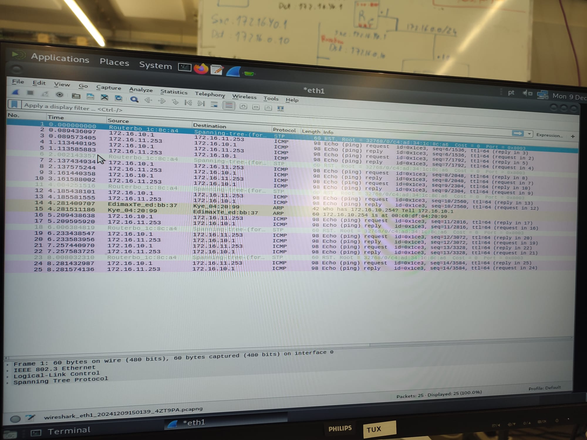

tux13 -> RC
`root@tux13: ping 172.16.11.254`
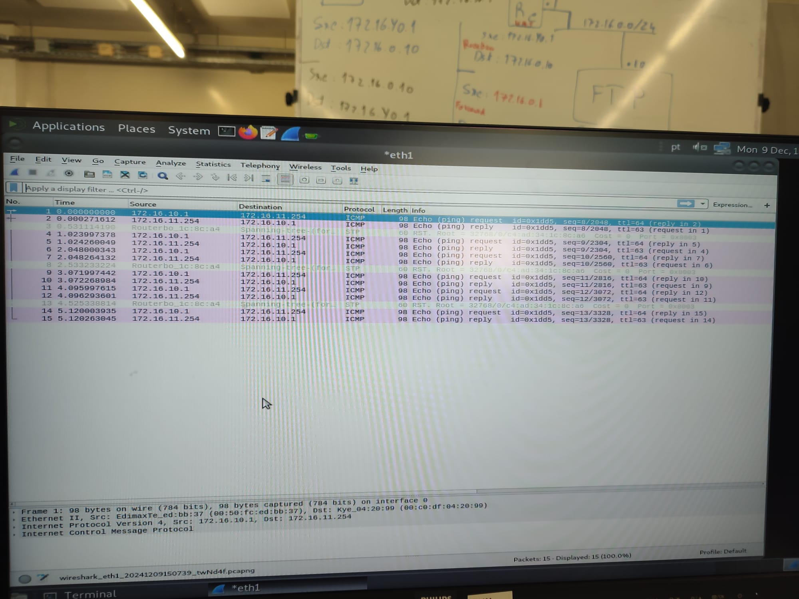


## 4

### 4.1
```bash
sysctl net.ipv4.conf.eth1.accept_redirects=0
sysctl net.ipv4.conf.all.accept_redirects=0 
```
### 4.2
`route del -net 172.16.10.0/24 gw 172.16.11.253`
`route add -net 172.16.10.0/24 gw 172.16.11.254`

`route del -net 172.16.10.0/24 gw 172.16.11.254`
`route add -net 172.16.10.0/24 gw 172.16.11.253`

### 4.3
- Ping tux12:
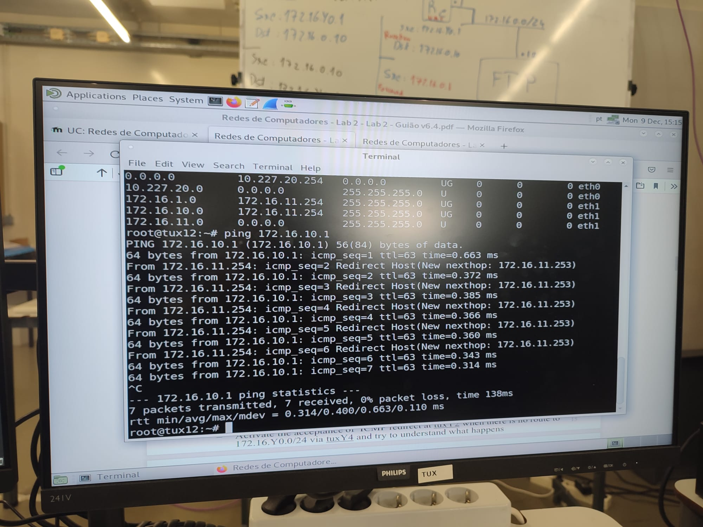

### 4.4
- Capture:
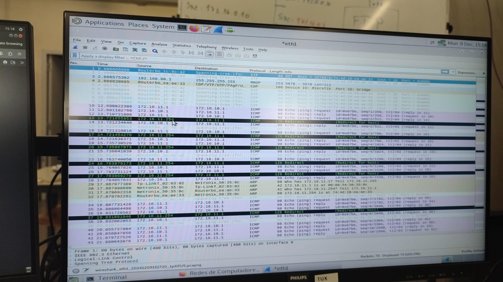


### 4.5 | 4.6
- Traceroute tux13 in tux12 before change:
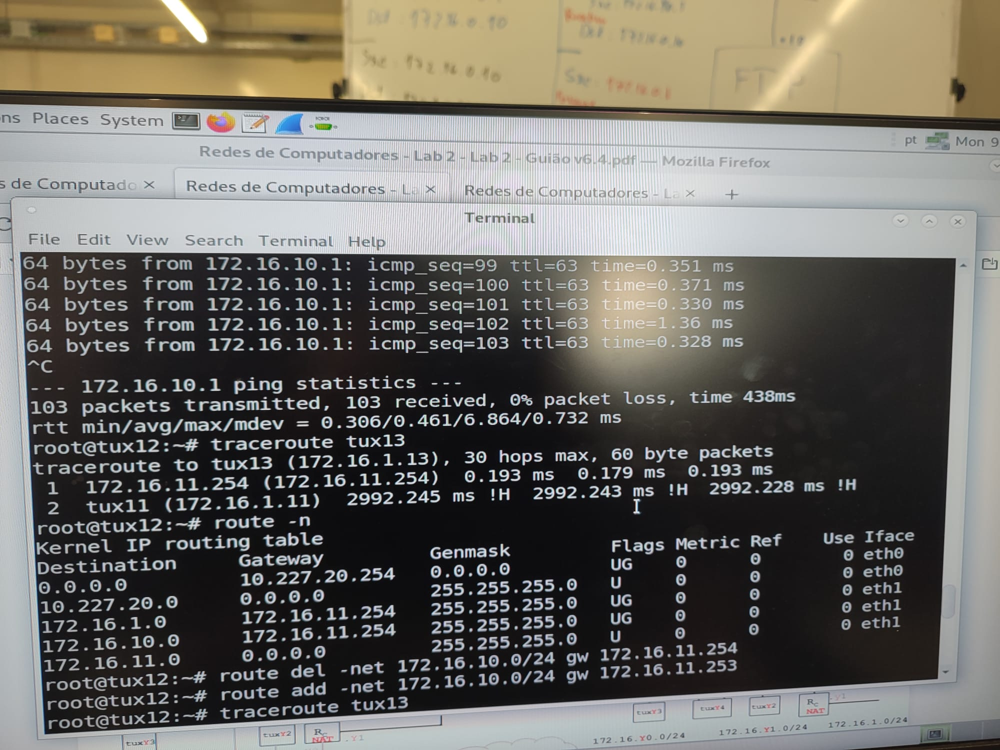

- Traceroute tux13 in tux12 after change
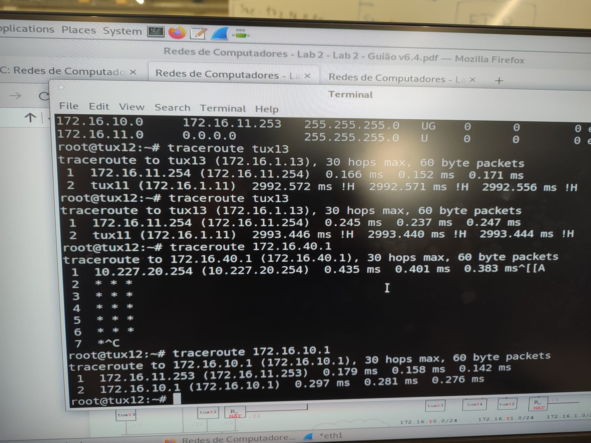

### Last step
```bash
sysctl net.ipv4.conf.eth1.accept_redirects=1
sysctl net.ipv4.conf.all.accept_redirects=1
```
`route del -net 172.16.10.0/24 gw 172.16.11.253`


## 5
`root@tux13: ping 172.16.1.10`
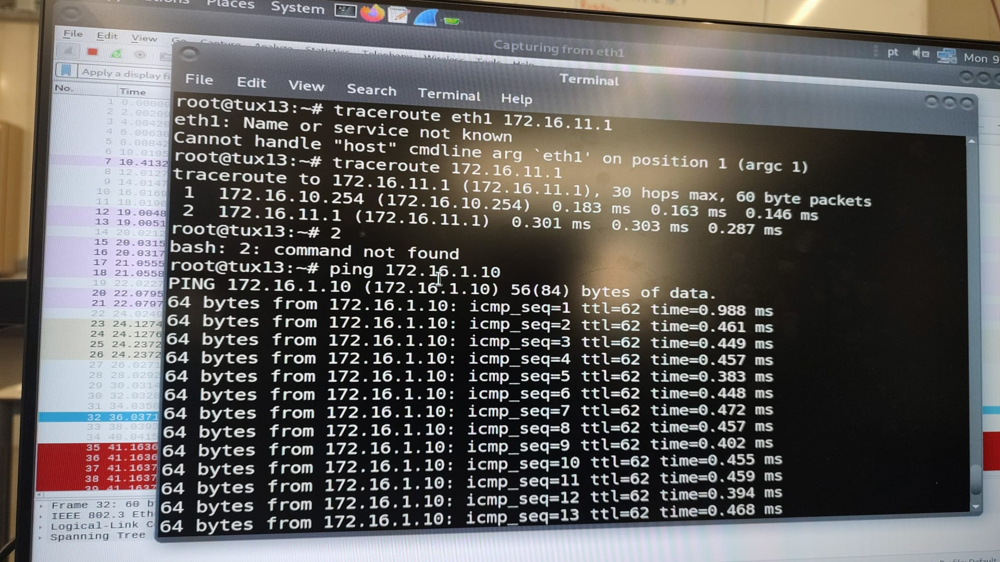

## 6
`/ip firewall nat disable 0`


## 7
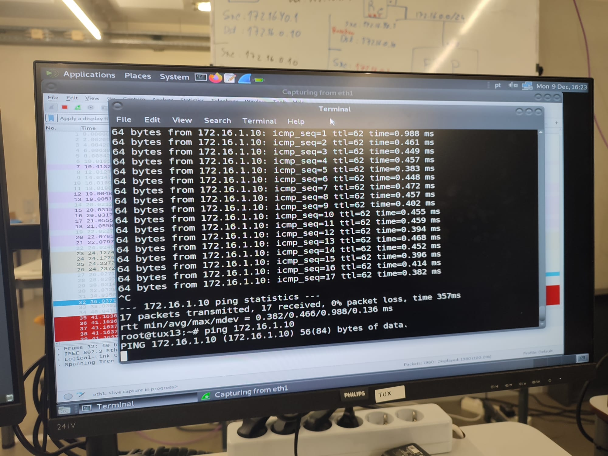
